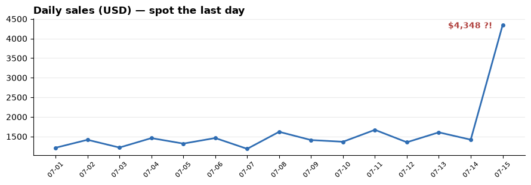
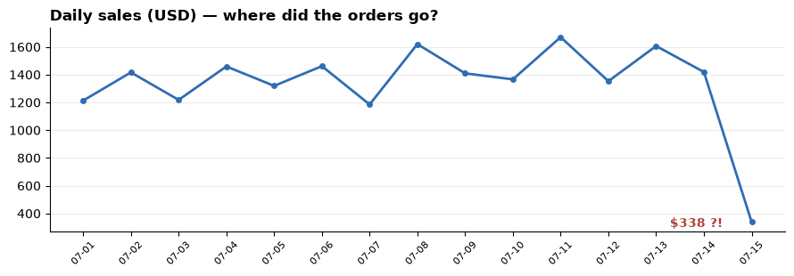

> *Auto-generated from [`dq_triage_demo.ipynb`](dq_triage_demo.ipynb) via `jupyter nbconvert --to markdown` — a readable version for GitHub. Edit the notebook, not this file.*

# AI Data-Quality Triage — a working demo

**The claim this notebook demonstrates:** *AI agents can take a raw data-quality alert and turn it into a complete, trustworthy incident diagnosis — automatically, in seconds, with humans involved only where risk demands it.*

The story: a small online shop (mugs, t-shirts, hoodies…). Something breaks in its sales data. Watch a team of small AI agents figure out **what** broke, **why**, **how much it matters**, and **what to do about it**.

What each part proves:

1. **Detection can stay dumb** — a simple threshold check fires the alert; a chart shows you the anomaly before any AI runs.
2. **The agents genuinely reason** — Act 2 reruns the *identical* agents on a different failure and gets a different, correct diagnosis.
3. **AI output can be trusted enough to act on** — Pydantic validates structure *and* meaning ("a confident root cause must cite evidence").
4. **Risk is governable** — P1 / high-risk / low-confidence outcomes route to a human; the rest may auto-apply.
5. **Waste is preventable** — a dedup gate short-circuits repeat alerts before any agent spends money.

| Layer | In this notebook | In production |
|---|---|---|
| Warehouse | in-memory SQLite | your real warehouse |
| Lineage + catalog | Python dicts | Glue / Collibra / dbt / OpenLineage via MCP |
| Detection | real checks (run here) | Great Expectations + ML drift |
| **AI agents** | **real** | **real (same code)** |
| **Pydantic validation** | **real** | **real** |
| **Orchestrator** | **real** | **real** |

> Runs out of the box in **MOCK mode** — no API key needed. Add an OpenAI or Anthropic key to a `.env` file to watch the agents reason live.
>
> *Honest boundary:* the enterprise plumbing is stubbed, so this demo confirms the **architecture**, not enterprise scale — and in production the diagnosis is only as good as your real lineage source.

## The map — how the cells fit together

Three layers, one story. The brain never touches the world directly — it only sees it through the plumbing's tool calls.

```text
┌─ THE FAKE WORLD ─── seed_shop() · plot_daily_sales() ───────────────┐
│  in-memory SQLite shop (products, orders, daily_sales)              │
│  + LINEAGE / CATALOG / CHANGES dicts (stand-ins for Glue/Collibra)  │
│  the bug is planted on the LAST day                                 │
└──────────────────────────────△──────────────────────────────────────┘
                    reads via  │  tool calls only
┌─ THE PLUMBING ───── make_mcp() · detect_issues() ───────────────────┐
│  mcp = a dict of 5 tool functions (swap for real MCP servers later) │
│  detection = 2 dumb threshold checks → a standardized EVENT dict    │
└──────────────────────────────△──────────────────────────────────────┘
                     asks via  │  ask_validated() — the only LLM door
┌─ THE BRAIN ──────── contracts · 4 agents · triage() ────────────────┐
│  4 Pydantic answer templates (shape + meaning checks)               │
│  4 agents: classifier / root-cause (looks UP) / severity (looks     │
│  DOWN) / planner (chained) · triage() = plain code + routing rule   │
└─────────────────────────────────────────────────────────────────────┘

flow:  seed → chart → detect → EVENT → triage:
       dedup gate → classify → root-cause → severity → plan → route
```

## Setup

One install cell. `openai` / `anthropic` are only exercised in live mode — MOCK mode needs neither at runtime.


```python
%pip install -q pydantic anthropic openai python-dotenv pandas matplotlib
```

    Note: you may need to restart the kernel to use updated packages.
    

    
    [notice] A new release of pip is available: 23.2.1 -> 26.1.2
    [notice] To update, run: python.exe -m pip install --upgrade pip
    

## Pick a mode

MOCK is the default: the full pipeline runs instantly with canned (but Pydantic-validated) agent responses. To go live, put `OPENAI_API_KEY` or `ANTHROPIC_API_KEY` (and optionally `MODEL`) in a `.env` file next to this notebook's repo root. Anthropic wins if both are set. There is no silent fallback: live mode errors surface as errors.


```python
import os
from dotenv import load_dotenv

load_dotenv()

if os.getenv("ANTHROPIC_API_KEY"):
    PROVIDER, MODEL = "anthropic", os.getenv("MODEL", "claude-sonnet-4-6")
elif os.getenv("OPENAI_API_KEY"):
    PROVIDER, MODEL = "openai", os.getenv("MODEL", "gpt-4o-mini")
else:
    PROVIDER, MODEL = "mock", None

print("MOCK mode — no LLM calls, canned responses" if PROVIDER == "mock"
      else f"LIVE mode — {PROVIDER} -> {MODEL}")
```

    MOCK mode — no LLM calls, canned responses
    

### X-ray mode (optional)

The demo normally hides its plumbing. Flip `VERBOSE = True` below and re-run the notebook to watch it live: every MCP tool call with its arguments and returned data, the exact prompt each agent sends, the raw LLM reply, and the validation verdict. The helpers are defined in the open so you can read exactly what they do: `xray()` prints one labeled block, and `instrument_mcp()` wraps each tool function so calls announce themselves — **the agents themselves never change**, which is itself the lesson: observability belongs in the plumbing, not the brain.


```python
import json

# ── X-ray mode ────────────────────────────────────────────────────────────────
# Flip to True and re-run the notebook to watch the machinery work: every MCP
# tool call with its arguments and returned data, the exact prompt each agent
# sends, the raw LLM reply, and the validation verdict.
VERBOSE = False

def xray(stage, title, payload=None):
    """Print one labeled X-ray block: WHO is doing WHAT, and the data involved.
    Does nothing unless VERBOSE is True — the demo's story code never changes."""
    if not VERBOSE:
        return
    print(f"      ┌─[x-ray · {stage}] {title}")
    if payload is not None:
        body = payload if isinstance(payload, str) else json.dumps(payload, indent=2, default=str)
        if len(body) > 600:
            body = body[:600] + f" … (+{len(body) - 600} more chars)"
        for line in body.splitlines():
            print(f"      │ {line}")
    print("      └─")

def instrument_mcp(tools):
    """Wrap every MCP tool function so each call announces itself: tool name,
    arguments in, data out. The agents calling them don't change at all —
    only the plumbing becomes visible. (This is exactly how you'd add
    observability to real MCP calls in production.)"""
    def wrap(name, fn):
        def wrapped(*args):
            out = fn(*args)
            xray("mcp", f"{name}({', '.join(repr(a) for a in args)})", out)
            return out
        return wrapped
    return {name: wrap(name, fn) for name, fn in tools.items()}

print(f"X-ray mode: {'ON — full data flow will be shown' if VERBOSE else 'off — flip VERBOSE = True to watch the plumbing'}")
```

    X-ray mode: off — flip VERBOSE = True to watch the plumbing
    

---
## Part 1 — The shop (with a planted bug)

Five products, ~40 orders a day, 15 days. `seed_shop` plants one of two bugs on the **last day**:

- `price_glitch` — someone fat-fingers the Coffee Mug's price to **$120 instead of $12** (a `manual_price_update` change event at 08:00). The mug is the best-seller (~40% of orders), so average order value jumps ~3x.
- `volume_drop` — the `order_ingest` pipeline fails at 06:30 and ~80% of the day's orders never arrive.

Lineage is the backbone: `products → orders → daily_sales → {sales_dashboard, finance_report, demand_forecast}`. Here it's a dict; in production it's your lineage tool behind an MCP server — same contract either way.


```python
import sqlite3, random
from datetime import date, timedelta

PRODUCTS = [
    # (sku, name, price, share of order volume)
    ("MUG-01", "Coffee Mug",   12.0, 0.40),
    ("TSH-02", "T-Shirt",      25.0, 0.20),
    ("NBK-03", "Notebook",      8.0, 0.15),
    ("BTL-04", "Water Bottle", 18.0, 0.15),
    ("HDY-05", "Hoodie",       40.0, 0.10),
]

def seed_shop(n_days=15, bug_type="price_glitch", magnitude=10.0, orders_per_day=40, seed=42):
    """In-memory shop warehouse with a bug planted on the last day.
    bug_type: "price_glitch" (magnitude = price multiplier) | "volume_drop" (magnitude = % of orders lost)
    """
    rng = random.Random(seed)
    base = date(2026, 7, 1)
    days = [base + timedelta(days=i) for i in range(n_days)]

    con = sqlite3.connect(":memory:")
    c = con.cursor()
    c.execute("CREATE TABLE products(sku TEXT, name TEXT, price REAL)")
    c.execute("CREATE TABLE orders(id INTEGER, date TEXT, sku TEXT, qty INTEGER, unit_price REAL, total REAL)")
    c.execute("CREATE TABLE daily_sales(date TEXT, total_sales REAL)")

    for sku, name, price, _ in PRODUCTS:
        c.execute("INSERT INTO products VALUES(?,?,?)", (sku, name, price))

    skus    = [p[0] for p in PRODUCTS]
    prices  = {p[0]: p[2] for p in PRODUCTS}
    weights = [p[3] for p in PRODUCTS]

    oid = 0
    for i, d in enumerate(days):
        is_bug_day = (i == n_days - 1)
        day_prices = dict(prices)
        if is_bug_day and bug_type == "price_glitch":
            day_prices["MUG-01"] = round(prices["MUG-01"] * magnitude, 2)
        n_orders = orders_per_day
        if is_bug_day and bug_type == "volume_drop":
            n_orders = max(1, int(orders_per_day * (1 - magnitude / 100)))
        for _ in range(n_orders):
            oid += 1
            sku = rng.choices(skus, weights=weights)[0]
            qty = rng.randint(1, 3)
            c.execute("INSERT INTO orders VALUES(?,?,?,?,?,?)",
                      (oid, d.isoformat(), sku, qty, day_prices[sku],
                       round(qty * day_prices[sku], 2)))

    for d in days:
        tot = c.execute("SELECT SUM(total) FROM orders WHERE date=?", (d.isoformat(),)).fetchone()[0] or 0.0
        c.execute("INSERT INTO daily_sales VALUES(?,?)", (d.isoformat(), round(tot, 2)))
    con.commit()

    LINEAGE = {
        "products":    {"upstream": [],                           "downstream": ["orders"]},
        "orders":      {"upstream": ["products", "order_ingest"], "downstream": ["daily_sales"]},
        "daily_sales": {"upstream": ["orders"],
                        "downstream": ["sales_dashboard", "finance_report", "demand_forecast"]},
    }
    CATALOG = {
        "orders":          {"criticality": "medium", "sensitivity": "financial"},
        "daily_sales":     {"criticality": "high",   "sensitivity": "financial"},
        "sales_dashboard": {"type": "dashboard",     "criticality": "high"},
        "finance_report":  {"type": "report",        "criticality": "regulatory"},
        "demand_forecast": {"type": "ml_feature",    "criticality": "medium"},
    }
    if bug_type == "price_glitch":
        CHANGES = [{"asset": "products",     "event": "manual_price_update", "at": f"{days[-1].isoformat()}T08:00Z"}]
    else:
        CHANGES = [{"asset": "order_ingest", "event": "pipeline_failure",    "at": f"{days[-1].isoformat()}T06:30Z"}]

    return con, c, days, LINEAGE, CATALOG, CHANGES

con, c, days, LINEAGE, CATALOG, CHANGES = seed_shop()
n_orders = c.execute("SELECT COUNT(*) FROM orders").fetchone()[0]
top_price = c.execute("SELECT MAX(unit_price) FROM orders WHERE date=?", (days[-1].isoformat(),)).fetchone()[0]
print(f"Seeded {len(days)} days, {n_orders} orders. Top unit price on the last day: ${top_price} (Coffee Mug normally $12)")
```

    Seeded 15 days, 600 orders. Top unit price on the last day: $120.0 (Coffee Mug normally $12)
    

### See the anomaly before any AI runs

Detection shouldn't be the impressive part. Your eye finds the problem instantly — the detectors just automate that glance.


```python
import pandas as pd
import matplotlib.pyplot as plt

def plot_daily_sales(con, title="Daily sales (USD)"):
    df = pd.read_sql_query("SELECT date, total_sales FROM daily_sales ORDER BY date", con)
    fig, ax = plt.subplots(figsize=(9, 3.2))
    ax.plot(range(len(df)), df["total_sales"], color="#2f6db3", linewidth=2,
            marker="o", markersize=4)
    last_i, last_v = len(df) - 1, df["total_sales"].iloc[-1]
    ax.annotate(f"${last_v:,.0f} ?!", (last_i, last_v), textcoords="offset points",
                xytext=(-66, -4), fontweight="bold", color="#b0413e")
    ax.set_xticks(range(len(df)))
    ax.set_xticklabels([d[5:] for d in df["date"]], rotation=45, fontsize=8)
    ax.set_title(title, loc="left", fontweight="bold")
    ax.spines[["top", "right"]].set_visible(False)
    ax.grid(axis="y", alpha=0.25)
    plt.tight_layout()
    plt.show()
    return df

_ = plot_daily_sales(con, "Daily sales (USD) — spot the last day")
```


    

    


---
## Part 2 — The MCP stub layer (how lineage is passed)

Agents never touch the lineage store directly. They see a **minimal, fixed tool contract** — asset name in, list of asset names out:

- `get_upstream(asset)` → `{"upstream": [...]}`
- `get_downstream(asset)` → `{"downstream": [...]}`
- `recent_changes(asset)` → `{"changes": [{"asset", "event", "at"}]}`
- `get_catalog(asset)` → `{tags}`
- `get_metrics(table, column)` → today-vs-baseline stats

**The contract is the standard; the backend is swappable.** Today these read a dict and SQLite. In production each is an MCP server that queries wherever lineage actually lives — AWS Glue, Collibra, dbt's manifest, or an OpenLineage event store — and *normalizes* the answer down to this same shape. The agents don't change; only the plumbing behind the tool does.


```python
import statistics

def make_mcp(c, days, LINEAGE, CATALOG, CHANGES):
    """MCP stub layer. Swap each function for a real MCP server call in production."""
    def get_upstream(asset):   return {"upstream": LINEAGE.get(asset, {}).get("upstream", [])}
    def get_downstream(asset): return {"downstream": LINEAGE.get(asset, {}).get("downstream", [])}
    def recent_changes(asset): return {"changes": [x for x in CHANGES if x["asset"] == asset]}
    def get_catalog(asset):    return CATALOG.get(asset, {})

    def get_metrics(table, column):
        today = days[-1].isoformat()
        if column == "record_count":
            t_cnt = c.execute(f"SELECT COUNT(*) FROM {table} WHERE date=?", (today,)).fetchone()[0]
            per_day = [r[0] for r in c.execute(
                f"SELECT COUNT(*) FROM {table} WHERE date<? GROUP BY date", (today,)).fetchall()]
            return {"today_count": t_cnt,
                    "baseline_avg_count": round(statistics.mean(per_day), 1) if per_day else 0,
                    "drift_started": today}
        t = [r[0] for r in c.execute(f"SELECT {column} FROM {table} WHERE date=?", (today,)).fetchall() if r[0] is not None]
        h = [r[0] for r in c.execute(f"SELECT {column} FROM {table} WHERE date<?", (today,)).fetchall() if r[0] is not None]
        if not t or not h:
            return {"today_mean": 0, "baseline_mean": 0}
        return {"today_mean": round(statistics.mean(t), 2),
                "baseline_mean": round(statistics.mean(h), 2),
                "today_max": round(max(t), 2), "drift_started": today}

    return {"get_upstream": get_upstream, "get_downstream": get_downstream,
            "recent_changes": recent_changes, "get_catalog": get_catalog,
            "get_metrics": get_metrics}

mcp = instrument_mcp(make_mcp(c, days, LINEAGE, CATALOG, CHANGES))
print("MCP stubs ready:", sorted(mcp))
```

    MCP stubs ready: ['get_catalog', 'get_downstream', 'get_metrics', 'get_upstream', 'recent_changes']
    

---
## Part 3 — Detection (dumb and fast, on purpose)

Two threshold checks. No AI here — the intelligence lives in triage. Each firing emits a **standardized issue event**: the one contract everything downstream consumes.


```python
import json

def detect_issues(c, days):
    events = []
    today = days[-1].isoformat()

    # Check 1 — order-value drift (today's mean > 2x baseline mean)
    t = [r[0] for r in c.execute("SELECT total FROM orders WHERE date=?", (today,)).fetchall()]
    h = [r[0] for r in c.execute("SELECT total FROM orders WHERE date<?", (today,)).fetchall()]
    if t and h:
        ratio = statistics.mean(t) / statistics.mean(h)
        if ratio > 2.0:
            events.append({
                "issue_id": f"dq-{today}-0001",
                "asset": "orders", "column": "total",
                "signal": "distribution_drift",
                "observed": {"today_mean": round(statistics.mean(t), 2),
                             "baseline_mean": round(statistics.mean(h), 2),
                             "ratio": round(ratio, 2)},
                "detected_at": f"{today}T14:03:11Z",
            })

    # Check 2 — order volume drop (today's count < 0.5x per-day baseline)
    today_cnt = c.execute("SELECT COUNT(*) FROM orders WHERE date=?", (today,)).fetchone()[0]
    per_day = [r[0] for r in c.execute(
        "SELECT COUNT(*) FROM orders WHERE date<? GROUP BY date", (today,)).fetchall()]
    if per_day:
        avg = statistics.mean(per_day)
        if today_cnt < avg * 0.5:
            events.append({
                "issue_id": f"dq-{today}-0002",
                "asset": "orders", "column": "record_count",
                "signal": "volume_drop",
                "observed": {"today_count": today_cnt, "baseline_avg": round(avg, 1),
                             "ratio": round(today_cnt / avg, 2)},
                "detected_at": f"{today}T14:03:11Z",
            })
    return events

events = detect_issues(c, days)
print(f"{len(events)} issue(s) detected\n")
print(json.dumps(events[0], indent=2) if events else "No issues — try a bigger magnitude.")
```

    1 issue(s) detected
    
    {
      "issue_id": "dq-2026-07-15-0001",
      "asset": "orders",
      "column": "total",
      "signal": "distribution_drift",
      "observed": {
        "today_mean": 108.7,
        "baseline_mean": 35.2,
        "ratio": 3.09
      },
      "detected_at": "2026-07-15T14:03:11Z"
    }
    

---
## Part 4 — Output contracts (Pydantic is the seatbelt)

Every agent must return JSON in an exact shape. Pydantic validates **types** and **meaning** — note the rule on `RootCause`: a confidence above 0.6 with no evidence is rejected outright. Bad output is caught before anything acts on it.


```python
from typing import Literal
from pydantic import BaseModel, Field, model_validator

class Classification(BaseModel):
    issue_type: str
    reasoning: str
    needs_human: bool = False

class RootCause(BaseModel):
    top_cause: str
    confidence: float = Field(ge=0, le=1)
    evidence: list[str]
    needs_human: bool = False

    @model_validator(mode="after")
    def _evidence_required(self):
        if self.confidence > 0.6 and not self.evidence:
            raise ValueError("high confidence must cite evidence")
        return self

class Severity(BaseModel):
    priority: Literal["P1", "P2", "P3", "P4"]
    blast_radius: int
    rationale: str
    needs_human: bool = False

class RemediationPlan(BaseModel):
    playbook: str
    risk: Literal["low", "medium", "high"]
    summary: str
    needs_human: bool = False

print("contracts defined")
```

    contracts defined
    

---
## Part 5 — The LLM client + self-healing validation

`ask_validated` is the loop that makes agents dependable: ask for JSON, validate with Pydantic, and on failure feed the error back and retry once. In MOCK mode the canned responses still pass through real Pydantic validation — the seatbelt is never off.


```python
import time

def call_llm(system, user, max_tokens=900):
    if PROVIDER == "anthropic":
        from anthropic import Anthropic
        r = Anthropic().messages.create(model=MODEL, max_tokens=max_tokens,
                                        system=system, messages=[{"role": "user", "content": user}])
        return r.content[0].text
    if PROVIDER == "openai":
        from openai import OpenAI
        r = OpenAI().chat.completions.create(model=MODEL, max_tokens=max_tokens,
            messages=[{"role": "system", "content": system}, {"role": "user", "content": user}])
        return r.choices[0].message.content
    raise RuntimeError("call_llm should never be reached in MOCK mode")

def _strip_fences(s):
    s = s.strip()
    if s.startswith("```"):
        s = s.split("```", 2)[1]
        if s.lower().startswith("json"):
            s = s[4:]
        s = s.lstrip("\n")
        if "```" in s:
            s = s.rsplit("```", 1)[0]
    return s.strip()

def _extract_json(s):
    """Pull the first JSON object out of an LLM reply. Models sometimes wrap the
    JSON in markdown fences or add prose before/after it despite instructions —
    parse leniently here, then validate strictly with Pydantic."""
    s = _strip_fences(s)
    start = s.find("{")
    if start == -1:
        raise ValueError(f"no JSON object in response: {s[:200]!r}")
    obj, _ = json.JSONDecoder().raw_decode(s[start:])
    return obj

MOCK_RESPONSES = {
    "distribution_drift": {
        "Classification": {"issue_type": "distribution_drift",
                           "reasoning": "today's average order value is ~3x baseline on a financial column",
                           "needs_human": False},
        "RootCause": {"top_cause": "manual price update set Coffee Mug (MUG-01) to $120 instead of $12",
                      "confidence": 0.9,
                      "evidence": ["products manual_price_update at 08:00 on the bug day",
                                   "order-value drift starts the same day",
                                   "only MUG-01 order totals are inflated (~10x)"],
                      "needs_human": False},
        "Severity": {"priority": "P1", "blast_radius": 3,
                     "rationale": "daily_sales feeds sales_dashboard, a regulatory finance_report, and the demand_forecast model",
                     "needs_human": False},
        "RemediationPlan": {"playbook": "correct_product_price_and_backfill", "risk": "medium",
                            "summary": "restore MUG-01 price to $12 and recompute the affected day's orders and daily_sales",
                            "needs_human": False},
    },
    "volume_drop": {
        "Classification": {"issue_type": "volume_drop",
                           "reasoning": "order count is ~80% below the daily baseline — looks like missing data, not a demand change",
                           "needs_human": False},
        "RootCause": {"top_cause": "order_ingest pipeline failure caused most of today's orders to never land",
                      "confidence": 0.85,
                      "evidence": ["order_ingest pipeline_failure at 06:30 on the bug day",
                                   "order count drops to ~20% of baseline the same day",
                                   "no price or product changes logged"],
                      "needs_human": False},
        "Severity": {"priority": "P1", "blast_radius": 3,
                     "rationale": "missing orders cascade to daily_sales, sales_dashboard, finance_report and demand_forecast",
                     "needs_human": False},
        "RemediationPlan": {"playbook": "rerun_order_ingest_and_backfill", "risk": "low",
                            "summary": "rerun the failed order_ingest pipeline for the affected date and recompute daily_sales",
                            "needs_human": False},
    },
}

def ask_validated(system, user, model_cls, signal, retries=1):
    if PROVIDER == "mock":
        xray("llm", f"MOCK reply for {model_cls.__name__} ({signal}) — still passes real Pydantic validation",
             MOCK_RESPONSES[signal][model_cls.__name__])
        return model_cls.model_validate(MOCK_RESPONSES[signal][model_cls.__name__])
    schema = json.dumps(model_cls.model_json_schema())
    prompt = "\n\n".join([user, "Return ONLY JSON matching this schema. No prose, no markdown fences:", schema])
    last = None
    for attempt in range(retries + 1):
        if attempt > 0:
            time.sleep(2)
            prompt = "\n\n".join([user, f"Previous answer failed validation: {last}",
                                  "Return ONLY valid JSON matching this schema:", schema])
        xray("llm", f"attempt {attempt + 1}: prompt sent for {model_cls.__name__}", prompt)
        raw = call_llm(system, prompt, max_tokens=900)
        xray("llm", f"attempt {attempt + 1}: raw reply", raw)
        try:
            result = model_cls.model_validate(_extract_json(raw))
            xray("llm", f"validation PASSED → {model_cls.__name__}")
            return result
        except Exception as e:
            last = e
            xray("llm", "validation FAILED — error will be fed back on retry", str(e))
    raise RuntimeError(f"Validation failed after {retries + 1} attempts: {last}")

print(f"LLM client ready (mode: {PROVIDER})")
```

    LLM client ready (mode: mock)
    

---
## Part 6 — The agents (division of labour)

Same lineage graph, opposite directions: **root-cause looks upstream** (what feeds the broken asset? what changed recently?), **severity looks downstream** (who consumes it? how critical are they?), the **classifier reads the asset itself**, and the **planner** waits for cause + severity because a fix needs both.


```python
def classifier_agent(ev, mcp):
    ctx = {"signal": ev["signal"], "column_tags": mcp["get_catalog"](ev["asset"]),
           "observed": ev["observed"]}
    return ask_validated("You label data-quality issues by type.",
                         f"Classify this issue.\nContext: {json.dumps(ctx)}",
                         Classification, ev["signal"])

def root_cause_agent(ev, mcp):
    upstream = mcp["get_upstream"](ev["asset"])["upstream"]
    changes = []
    for asset in [ev["asset"]] + upstream:
        changes.extend(mcp["recent_changes"](asset)["changes"])
    ctx = {"upstream": upstream, "recent_changes": changes,
           "metrics": mcp["get_metrics"](ev["asset"], ev["column"])}
    return ask_validated(
        "You diagnose WHY data broke. Check upstream assets and recent changes. "
        "Cite specific evidence. If confidence < 0.5 set needs_human true.",
        f"Find the root cause.\nContext: {json.dumps(ctx, default=str)}",
        RootCause, ev["signal"])

def severity_agent(ev, mcp):
    downs = mcp["get_downstream"]("daily_sales")["downstream"]
    ctx = {"downstream": downs, "consumer_tags": {a: mcp["get_catalog"](a) for a in downs}}
    return ask_validated(
        "You score severity P1-P4 by downstream blast radius and consumer criticality. "
        "Regulatory and financial consumers raise the priority.",
        f"Score severity.\nContext: {json.dumps(ctx)}", Severity, ev["signal"])

def planner_agent(ev, rc, sev):
    ctx = {"signal": ev["signal"], "root_cause": rc.top_cause, "priority": sev.priority}
    return ask_validated(
        "You propose a remediation playbook name and rate its risk as low, medium, or high.",
        f"Propose a fix.\nContext: {json.dumps(ctx)}", RemediationPlan, ev["signal"])

print("agents ready")
```

    agents ready
    

---
## Part 7 — The orchestrator (plain code, not an LLM)

Dedup gate first — a repeat alert stops **before** any agent spends money. Then the three independent agents (sequential here for a readable trace; parallel in production), then the chained planner, then one routing decision that aggregates every risk flag: P1, high-risk fix, low confidence, or any agent asking for a human.


```python
def log(step, msg): print(f"  [{step:^10}] {msg}")

def triage(ev, mcp, open_cases):
    print("=" * 64)
    print("TRIAGE:", ev["issue_id"], "|", ev["asset"], "|", ev["signal"])
    print("=" * 64)

    sig = (ev["asset"], ev["signal"])
    if sig in open_cases:
        log("dedup", "duplicate -> attach to open case, STOP (no agent calls)")
        return {"routing": "deduped"}
    open_cases.add(sig)
    log("dedup", "new issue, proceeding")

    cls = classifier_agent(ev, mcp);   log("classify",   cls.issue_type)
    rc  = root_cause_agent(ev, mcp);   log("root-cause", f"{rc.top_cause} (conf {rc.confidence})")
    sev = severity_agent(ev, mcp);     log("severity",   f"{sev.priority}, blast_radius={sev.blast_radius}")
    plan = planner_agent(ev, rc, sev); log("plan",       f"{plan.playbook} (risk {plan.risk})")

    notes = []
    if sev.priority == "P1": notes.append("P1 severity")
    if plan.risk == "high":  notes.append("high-risk fix")
    if rc.confidence < 0.5:  notes.append("low confidence")
    if any(a.needs_human for a in (cls, rc, sev, plan)): notes.append("agent flagged")
    routing = "human" if notes else "auto"
    log("route", f"{routing.upper()} {notes}")

    return {"issue_id": ev["issue_id"], "classification": cls.model_dump(),
            "root_cause": rc.model_dump(), "severity": sev.model_dump(),
            "plan": plan.model_dump(), "routing": routing, "notes": notes}

print("orchestrator ready")
```

    orchestrator ready
    

---
## Act 1 — Triage the price glitch

Detection already fired the event above. Now watch the full pipeline: gate → classify → root-cause → severity → plan → route. Note the verdict routes to a **human**: a P1 on a regulatory feed *should not* auto-fix — the gate working is the feature.


```python
open_cases = set()
verdict = triage(events[0], mcp, open_cases)
print("\nFINAL VERDICT")
print(json.dumps(verdict, indent=2))
```

    ================================================================
    TRIAGE: dq-2026-07-15-0001 | orders | distribution_drift
    ================================================================
      [  dedup   ] new issue, proceeding
      [ classify ] distribution_drift
      [root-cause] manual price update set Coffee Mug (MUG-01) to $120 instead of $12 (conf 0.9)
      [ severity ] P1, blast_radius=3
      [   plan   ] correct_product_price_and_backfill (risk medium)
      [  route   ] HUMAN ['P1 severity']
    
    FINAL VERDICT
    {
      "issue_id": "dq-2026-07-15-0001",
      "classification": {
        "issue_type": "distribution_drift",
        "reasoning": "today's average order value is ~3x baseline on a financial column",
        "needs_human": false
      },
      "root_cause": {
        "top_cause": "manual price update set Coffee Mug (MUG-01) to $120 instead of $12",
        "confidence": 0.9,
        "evidence": [
          "products manual_price_update at 08:00 on the bug day",
          "order-value drift starts the same day",
          "only MUG-01 order totals are inflated (~10x)"
        ],
        "needs_human": false
      },
      "severity": {
        "priority": "P1",
        "blast_radius": 3,
        "rationale": "daily_sales feeds sales_dashboard, a regulatory finance_report, and the demand_forecast model",
        "needs_human": false
      },
      "plan": {
        "playbook": "correct_product_price_and_backfill",
        "risk": "medium",
        "summary": "restore MUG-01 price to $12 and recompute the affected day's orders and daily_sales",
        "needs_human": false
      },
      "routing": "human",
      "notes": [
        "P1 severity"
      ]
    }
    

### Same alert again — watch the dedup gate

The second run stops at the gate: no agent calls, no cost.


```python
_ = triage(events[0], mcp, open_cases)
```

    ================================================================
    TRIAGE: dq-2026-07-15-0001 | orders | distribution_drift
    ================================================================
      [  dedup   ] duplicate -> attach to open case, STOP (no agent calls)
    

---
## Act 2 — A different failure, the identical agents

Now the proof of generality. Reseed the shop with a **different** bug — the `order_ingest` pipeline fails and 80% of the day's orders never arrive. **Not one line of agent code changes.** Different evidence goes in (a pipeline failure upstream, a volume metric down 80%), a different diagnosis comes out.


```python
con2, c2, days2, LINEAGE2, CATALOG2, CHANGES2 = seed_shop(bug_type="volume_drop", magnitude=80)
mcp2 = instrument_mcp(make_mcp(c2, days2, LINEAGE2, CATALOG2, CHANGES2))
_ = plot_daily_sales(con2, "Daily sales (USD) — where did the orders go?")

events2 = detect_issues(c2, days2)
print(json.dumps(events2[0], indent=2), "\n")
verdict2 = triage(events2[0], mcp2, set())
```


    

    


    {
      "issue_id": "dq-2026-07-15-0002",
      "asset": "orders",
      "column": "record_count",
      "signal": "volume_drop",
      "observed": {
        "today_count": 7,
        "baseline_avg": 40,
        "ratio": 0.17
      },
      "detected_at": "2026-07-15T14:03:11Z"
    } 
    
    ================================================================
    TRIAGE: dq-2026-07-15-0002 | orders | volume_drop
    ================================================================
      [  dedup   ] new issue, proceeding
      [ classify ] volume_drop
      [root-cause] order_ingest pipeline failure caused most of today's orders to never land (conf 0.85)
      [ severity ] P1, blast_radius=3
      [   plan   ] rerun_order_ingest_and_backfill (risk low)
      [  route   ] HUMAN ['P1 severity']
    

---
## What's real, what's stubbed, where this goes

**Real:** detection, the four agents, the MCP-style tool contracts, Pydantic validation with the retry loop, the orchestrator and its routing policy.

**Stubbed (and designed to be swapped):**
- `LINEAGE` / `CATALOG` dicts → a `lineage-mcp` / `catalog-mcp` over Glue, Collibra, dbt, or OpenLineage
- the SQLite shop → your warehouse behind a `metrics-mcp`
- the planted bugs → real detector output

**What this demo does *not* prove:** enterprise scale, or resilience to incomplete lineage. In production the diagnosis is only as good as the lineage you feed it — that's a data investment, not an AI problem.

**Next steps in this repo:** the same pipeline powers an interactive Streamlit app — `streamlit run dq/app.py` — with sliders for scenario and magnitude. From there: persist cases to a real store, wire one real MCP server, and only then consider gated auto-fix.

*The one-liner: the enterprise plumbing is stubbed; the AI brain is real. Point the stubs at real MCP servers and this ships.*
